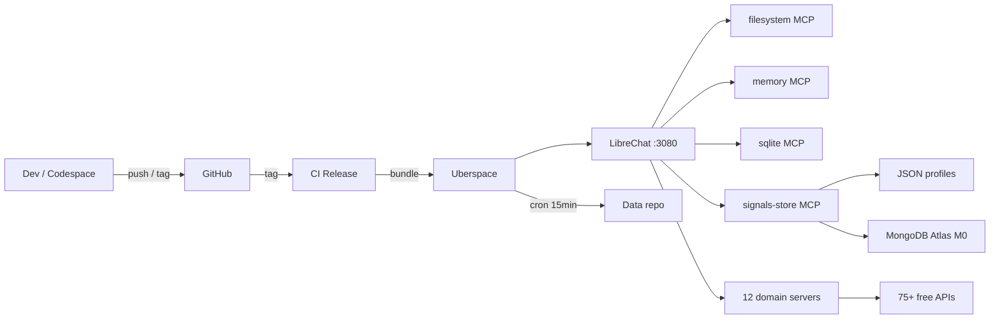

### TradingAssistant

- 12 MCP domain servers querying 75+ free data sources
- Hybrid store: JSON profiles (git-tracked) + MongoDB snapshots (TTL)
- Deployed via LibreChat on Uberspace, no Docker needed
- CI release workflow with one-liner install and `ta` ops CLI

## Architecture



## Storage

| Layer | What | Format | Update Freq |
|-------|------|--------|-------------|
| JSON profiles | Identity, exposure, risk factors | 1 file per entity, git-tracked | Manual / monthly |
| Atlas M0 snapshots | Time-series indicators, events | Documents with TTL auto-prune | Hourly → quarterly |
| MCP live queries | Current data from 75+ APIs | On-demand | Real-time |

**Design principle:** Profile = what it **is**. Snapshot = what was measured **when**. MCP = current **live** state.

## Deploy to Uberspace

```bash
ssh assist@assist.uber.space
curl -sL https://raw.githubusercontent.com/ManuelKugelmann/TradingAssistant/main/librechat-uberspace/scripts/TradeAssistant.sh | bash
```

Then configure `nano ~/mcps/.env` and `nano ~/LibreChat/.env`, then `supervisorctl start librechat`. Re-run safe — skips what's already done, preserves config.

## Quick Start (local dev)

```bash
git clone https://github.com/ManuelKugelmann/TradingAssistant.git
cd TradingAssistant
python3 -m venv venv && source venv/bin/activate
pip install -r requirements.txt
cp .env.example .env   # edit with MONGO_URI + API keys
python src/store/server.py
```

## Data Coverage (75+ sources, 12 domains)

| Domain | Sources | Auth | Key APIs |
|--------|---------|------|----------|
| 🌾 Agriculture | 6 | Mixed | FAOSTAT, USDA NASS/FAS |
| 🔥 Disasters | 6 | Mostly none | USGS, GDACS, NASA FIRMS/EONET |
| 🗳️ Elections | 6 | Mixed | IFES, V-Dem, Google Civic |
| 📊 Macro | 8 | Mostly none | FRED, World Bank, IMF, ECB |
| 🌧️ Weather | 5 | Mostly none | Open-Meteo, NOAA SWPC |
| ⛏️ Commodities | 5 | Mixed | UN Comtrade, EIA |
| ⚔️ Military | 7 | Mixed | UCDP, ACLED, OpenSanctions |
| 🏥 Medical | 9 | Mostly none | WHO, disease.sh, OpenFDA |
| 🚢 Shipping | 3 | Mixed | AIS Stream, OpenSky |
| 🌊 Water | 4 | None | USGS Water, Drought Monitor |
| 👥 Humanitarian | 4 | None | UNHCR, OCHA HDX |
| 🌐 Internet | 4 | Mixed | Cloudflare Radar, RIPE Atlas |

**28 sources need zero API key. 15 need a free key. 0 paid.**

## Storage Budget

| Store | Size | Growth |
|-------|------|--------|
| 📁 Profiles | ~5 MB | Negligible |
| ☁️ Atlas snapshots | ~60 MB/year | 512 MB = ~8 years free |

## License

MIT
